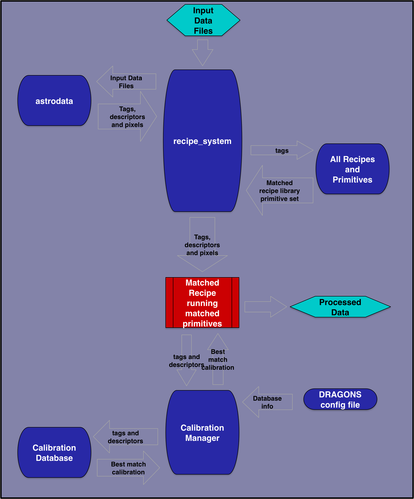

.. what_is_dragons.rst

.. _what_is_dragons:

***************
What is DRAGONS
***************

What it is
----------

DRAGONS is a platform for the reduction and processing of astronomical data.
It is a Python meta-package that includes infrastructure for automation and
algorithms for processing astronomical data.  Currently, it focuses on the
reduction of Gemini data, but hooks are available for expansion to data from
other observatories.

Now really, what is DRAGONS?

With a little bit of guidance from you, DRAGONS will reduce your Gemini data
in a standard way, rapidly, with little fuss.  With a bit more guidance from
you, DRAGONS will let you optimize the reduction for your specific sources
and science objectives.

DRAGONS is operated through the ``reduce`` command from the shell, or the
``Reduce`` class from a Python script.  You choose.  For clarity, we will refer
to ``reduce`` only from now on, but it's the same thing.  A call to `reduce`
activates the "Recipe System" which is what automates everything.

When ``reduce`` is called, the first FITS file is opened and identified, then
the libraries of algorithms collected as "primitives" and "recipes" will be
searched and the best matches will be selected and run on the data.  We will
go through all that later.

The FITS files are opened with the ``astrodata`` facility.  When a FITS file is
opened with ``astrodata``, it knows about itself.  For example, it knows that
it is a NIRI file and an IMAGING FLAT.   This is how the Recipe System will
know which recipes and which primitives to load and run.

The other important component of the DRAGONS automation infrastruture is the
calibration manager.  It is operated with the ``caldb`` command.  (Again,
there's an API too.)  This accesses a light weight ``sqlite`` database that
will store information about your local processed calibrations.  When a
primitive is run and needs a calibration, the system will automatically
fetch it, you do not have to specify it on the command line.  (You can if you
really want to.)

Then there's a series of utilities for sorting through the data and learning
about the primitives and the recipes.

Here's what DRAGONS can look like from a user's point view::

    dataselect *.fits --tags=FLAT -o flat.lis
    dataselect *.fits --expr="object='mycooltarget'" -o sci.lis
    caldb init
    reduce @flat.lis
    caldb add *_flat.fits
    reduce @sci.lis

The steps are:

1. Create your lists of input data
2. Initialize your calibration database
3. Reduce your calibrations and upload the info to the database
4. Reduce your science, it will pick up the calibrations by itself.

As straightforward as a reduction can be, it can be customized
to match your needs.  The options to primtives can be adjusted, the recipes
themselves can be adjusted.

In this basic introduction to DRAGONS, we will explore all this and learn how to
have DRAGONS do our bidding.

What it is not
--------------

DRAGONS is **not** a data analysis package.  DRAGONS prepares the data for
analysis but does not offer tools to do it.  DRAGONS is also not a replacement
for IRAF.

To inspect your data, to do any sort of analysis like photometry, measuring
redshift, calculating equivalent width, etc, you will have to find another
tool.  DRAGONS does provide a primtive to display an image to ds9, but it will
just display it.  Similarly, in an upcoming release, there will be a tool to
plot a 1D spectrum, and again, it will just plot it, it not offer any
measurement tools.

Any analysis-type tools are beyond the scope of DRAGONS.

Components in action
--------------------

The diagram below illustrates how the components communicate with each other
and in particular how the astrodata tags and descriptors are passed around to
make decisions about the best matched recipe, primitive sets, and calibrations.

