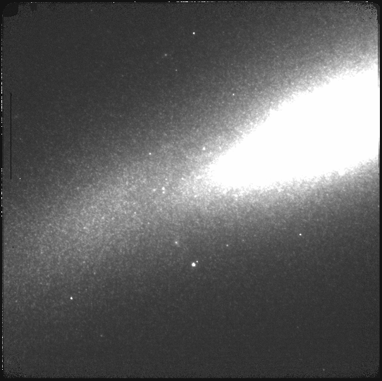

.. demo_imaging.rst

.. include:: DRAGONSlinks.txt

.. _basic1_demo_imaging:

************
Demo imaging
************

To get ourselves oriented and get a feel for how data is processed with
DRAGONS, we will run a full reduction on our sample data.  The full tutorial
using this data can be found at `<https://dragons.readthedocs.io/projects/niriimg-drtutorial/en/stable/index.html>`_.

Here, we go through the steps with quite a bit
less discussion than in the full tutorial as the purpose is simply to provide
some context and an idea of a typical data reduction flow to those who have
not experience it before.

The observations are of an extended source, a nearby galaxy.  The instrument
used is NIRI.  The science sequence is a series of dithers on target with full
offset to sky.  We will create a master dark, a master flat, a reduced
flux standard, and finally create a calibrated, sky-subtracted stack of the
science observations.

Let's run all the steps.

#. Set up the local calibration manager
#. Create the file lists
#. Create the calibration files (dark, flat)
#. Reduce the flux standard
#. Reduce the science observations

::

    cd <where_the_data_package_is>/niriimg_tutorial/playground

Set up the local calibration manager
====================================
We will discuss the local calibration manager in a later chapter.

The calibration manager is the first thing to set up when starting on a data
reduction project.  It provides the automated calibration association.

The file to pay attention to is: ``~/.geminidr/rsys.cfg`` (DRAGONS v3.0)

For this example, that file to contain the following::

    [calibs]
    standalone = True
    database_dir = <where_the_data_package_is>/niriimg_tutorial/playground

About the path for ``database_dir``, we recommend the directory you are using
to work on the data.  But it can be anywhere.

Once the configuration file is set up, initialize the database.  This needs to
be done only once per database.

::

    caldb init

This creates a new file, ``cal_manager.db``, in the directory specified by
``database_dir``.

Create the file lists
=====================
The user has to sort the files.  DRAGONS is a "User in the loop" pipeline.
We have some tools to help.  We will have a closer look at them later.

We have long darks that match the science, a series of lamp-on and lamp-off
flats, a set of on-target dithered observations for a flux standard, and
a set of on-target dithered and off-target dithered observations for the
science target.

::

    dataselect ../playdata/*.fits --tags DARK --expr='exposure_time==20' -o darks20s.lis

    dataselect ../playdata/*.fits --tags FLAT -o flats.lis

    dataselect ../playdata/*.fits --expr='object=="FS 17"' -o stdstar.lis

    dataselect ../playdata/*.fits --expr='object=="SN2014J"' -o target.lis

Create the master dark and the master flat
====================================================

**Dark**

Create the master dark and add it to the calibration manager.

::

    reduce @darks20s.lis
    caldb add N20160102S0423_dark.fits

The ``@`` character before the name of the input file is the "at-file" syntax.
We will look into this later.

.. _basic1_demo_flat:

**Flat**

Create the master flat from the lamp-on and lamp-off flats and add it to the
calibration database.

::

    reduce @flats.lis
    caldb add N20160102S0373_flat.fits

Reduce the flux standard
========================
This is short series of on-target dither observations.  Darks are not obtained
for NIRI flux standard so we turn that step off.  The flat will be picked up
from the calibration database.

::

    reduce @stdstar.lis -p darkCorrect:do_cal=skip

Reduce the science observations
===============================
The sequence is a set of dither on target with full offsets to sky.  DRAGONS
will sort them during the sky correction.  All calibrations are picked up
automatically from the calibration database.  Because the target fills the
field of view, we need to turn off the scaling of the sky frames.

::

    reduce @target.lis -p skyCorrect:scale_sky=False

.. image:: _graphics/extended_before.png
   :scale: 60%
   :align: left

