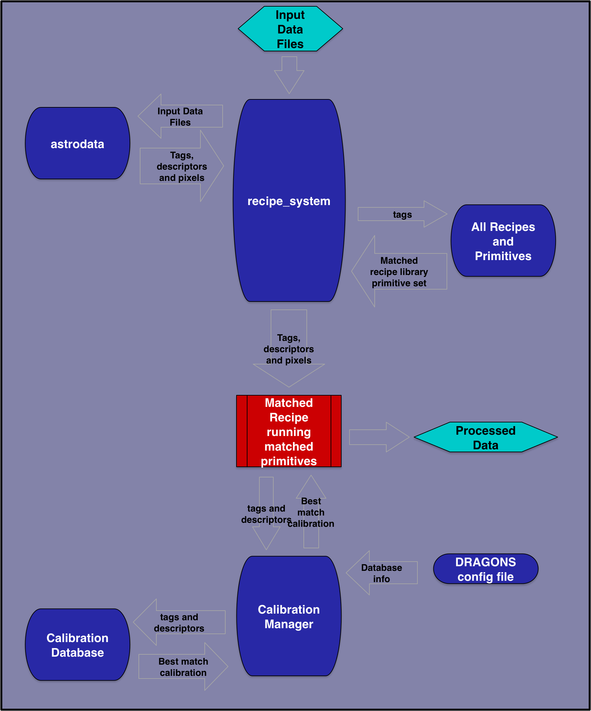

.. what_is_dragons.rst

.. _basic1_what_is_dragons:

***************
What is DRAGONS
***************

What it is
----------

With a little bit of guidance from you, DRAGONS will reduce your Gemini data
in a standard way, rapidly, with little fuss.  With a bit more guidance from
you, DRAGONS will let you optimize the reduction for your specific sources
and science objectives.

DRAGONS is operated through the ``reduce`` command from the shell, or the
``Reduce`` class from a Python script.  You choose.  For clarity, we will refer
to ``reduce`` only from now on, but it's the same thing.  A call to `reduce`
activates the "Recipe System" which is what automates everything.

When ``reduce`` is called, the first FITS file is opened and identified, then
the libraries of algorithms collected as "primitives" and "recipes" will be
searched and the best matches will be selected and run on the data.

An important component of the DRAGONS automation infrastructure is the
calibration manager.  It is operated with the ``caldb`` command.  (Again,
there's an API too.)  This accesses a lightweight local database that
will store information about your locally-processed calibrations.  When a
primitive is run and needs a calibration, the system will automatically
identify the best matched processed calibration and use it, you do not have to
specify it on the command line.  (Though, you can if you really want to.)

Then there's a series of utilities for sorting through the data and learning
about the primitives and the recipes.

All of it uses ``astrodata`` which is used to open the FITS files.  Once a file
is opened with ``astrodata``, it "knows about itself" and that's how it can
find the recipes, primitives, and calibration it needs.

Here's what DRAGONS can look like from a user's point view::

    dataselect *.fits --tags=FLAT -o flat.lis
    dataselect *.fits --expr="object='mycooltarget'" -o sci.lis
    caldb init
    reduce @flat.lis
    caldb add *_flat.fits
    reduce @sci.lis

The steps are:

1. Create your lists of input data.
2. Initialize your calibration database.
3. Reduce your calibrations and upload the info to the database.
4. Reduce your science, it will pick up the calibrations by itself.

As straightforward as a reduction can be, it can be customized
to match your needs.  The options to the primitives can be adjusted, the recipes
themselves can be adjusted.

In this basic introduction to DRAGONS, we will explore all this and learn how to
have DRAGONS do our bidding.

What it is not
--------------

DRAGONS is **not** a data analysis package.  DRAGONS prepares the data for
analysis but does not offer tools to do the analysis.  Also, DRAGONS is also
not a replacement for IRAF.

To inspect your data, to do any sort of analysis like photometry, measuring
redshift, calculating equivalent width, etc, you will have to find another
tool.  DRAGONS does provide a primitive to display an image to ds9, but it will
just display it.  Similarly, there is a tool to plot a 1D spectrum, and again,
it will just plot it, it not offer any measurement capabilities.

Any analysis-type tools are beyond the scope of DRAGONS.

Components in action
--------------------

The diagram below illustrates how the components communicate with each other
and in particular how the ``astrodata`` tags and descriptors are passed around
to make decisions about the best matched recipe, primitive sets, and
calibrations.

