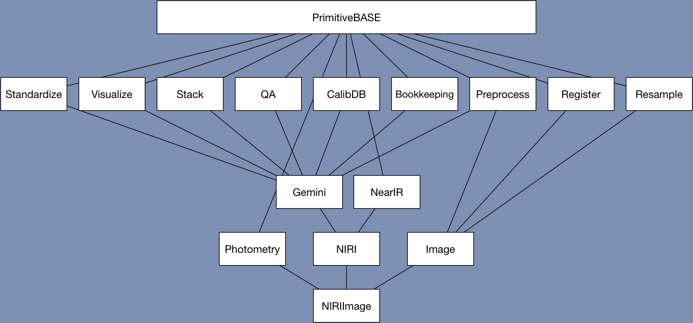

.. what_are_primitives.rst

.. include:: DRAGONSlinks.txt

.. _primitives:

*******************
What are primitives
*******************

Primitives and primitive sets
=============================
A primitive is a data reduction step involving a transformation of the data or
providing a service. By convention, the primitives are named to convey the
scientific meaning of the transformation. For example ``biasCorrect`` will
remove the bias signal from the input data.

A primitive is always a member of a primitive set. It is the primitive set
that gets matched to the data by the Recipe System, not the individual
primitives.

Technically, a primitive is a method of a primitive class. A primitive class
gets associated with the input dataset by matching the ``astrodata`` tags. Once
associated, all the primitives in that class, locally defined or inherited,
are available to reduce that dataset. We refer to that collection of
primitives as a “primitive set”.

All the primitives are currently found in the Python package ``geminidr``.
In there, there is a large inheritance tree of primitive classes from very
generic to very specific.

For example, NIRI images will be associated with the ``NIRIImage``
primitive set.  This set contains all the primitives it needs through
primitives defined in ``NIRIImage`` itself and through its inheritance
tree.  We illustrate that tree in Figure 1.

   Figure 1: NIRIImage inheritance tree.

Once the primitive set is identified, DRAGONS will send that to the
selected recipe as that ``p`` argument we saw in the previous chapter.

Primitive input parameters
==========================
Also attached to a primitive set are the input parameters for each primitives
and the defaults appropriate for that primitive set, that is for that type
of data.

For the same generic primitive, the default values for input parameters for
NIRI data can be different from the defaults applicable to GMOS data.  Even
the set of available input parameters can be different, though we try to
keep things a uniform as possible.

We will learn later how to customize the values of input parameters.  The
first step however is to see what the input parameters are and what their
default values are.   This is done with the |showpars| command.

Because the input parameters can be different for different type of data, the
command requires the name of file, and then of course the name of the
primitive you want to learn about.

The command signature is as follow::

   showpars filename primitive_name

.. _ex_primitives1:

.. admonition:: Exercise - Primitives 1

   Using the science frame ``N20160102S0270.fits`` located in directory
   ``playdata``, find the answer to the questions below.  First, show the
   recipe for that file to see the list of primitives.  (Hint: ``showrecipes``)

   #. What is the default operation used to combine the sky frames during sky
      correction?
   #. Which parameter from which primitive do I need to modify to turn off
      the dark correction?
   #. Which parameter from which primtiive do I need to modify to change the
      rejection method during the final stacking of the frames?  What are the
      available options?

   [:ref:`Solution <solution_primitives1>`]

.. showrecipes ../playdata/N20160102S0270.fits

.. showpars ../playdata/N20160102S0270.fits skyCorrect
   -> operation = 'median'

.. showpars ../playdata/N20160102S0270.fits darkCorrect
   -> do_dark.  Set it to False.

.. showpars ../playdata/N20160102S0270.fits stackFrames
   -> reject_method.  Options: minmax, none, varclip, sigclip

